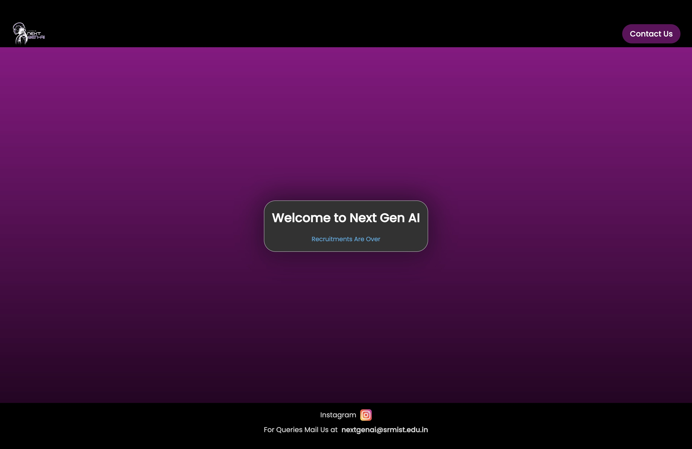
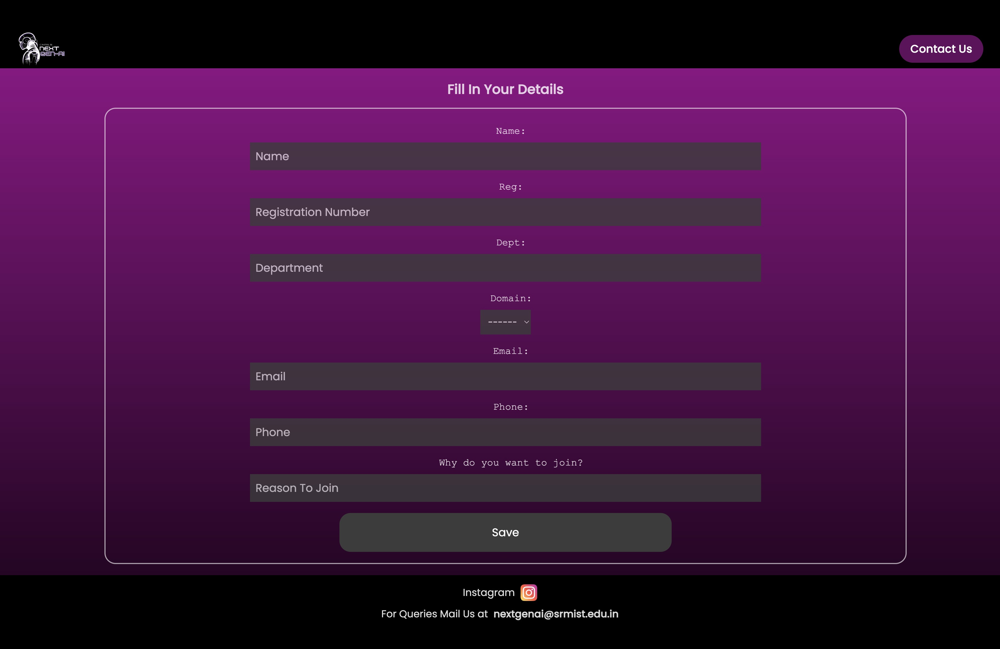
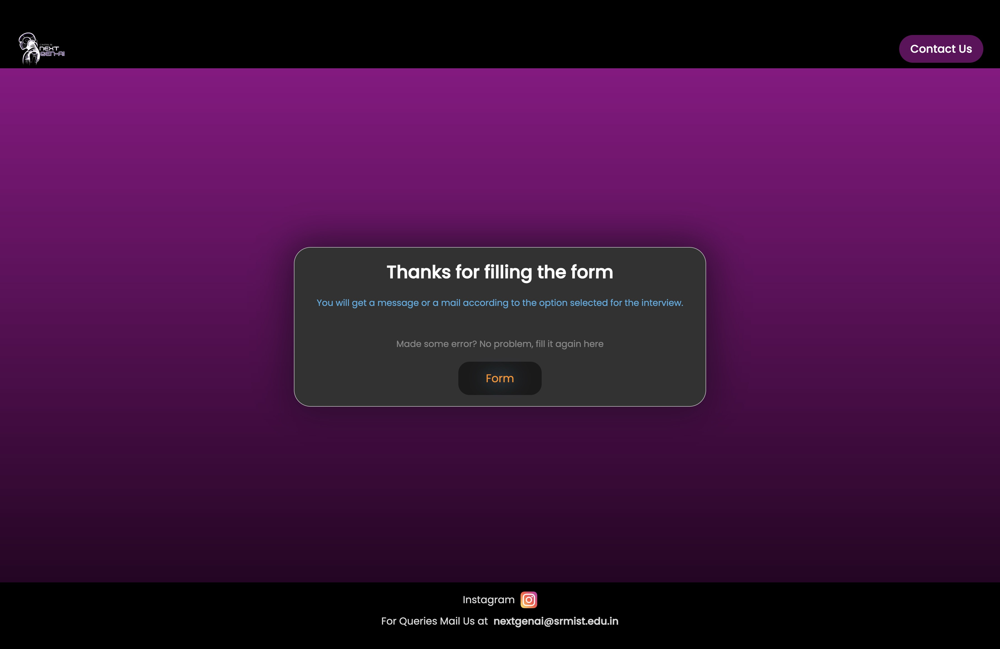
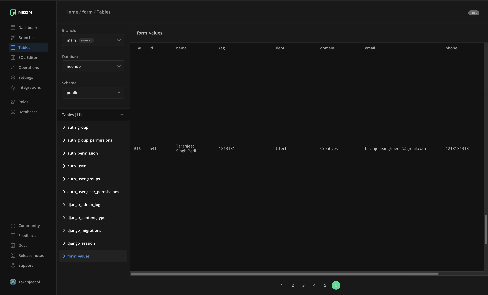

<h1>NGAI Recruitment</h1>

This is a website made for submitting data for the users to fill up the a registration form for a club recruitment.
<h2>General Information</h2>

<ul>
<li>The site is works as a custom form for recruitment</li>
</ul><ul>
<li>The data is saved using PostGreSql</li>
</ul><ul>
<li>Online database is used.</li>
</ul><h2>Technologies Used</h2>

<ul align="center">
 

 
 
</ul><h2>Important Links</h2>

<ul>
<li>Website Link : https://ngairecruitment.web.app/</li>
</ul><ul>
<li>As the form has been closed, here is just the form link : https://ngairecruitments.vercel.app/</li>
</ul>
</ul><h2>Features</h2>

<ul>
<li>Export data as CSV</li>
</ul><ul>

<li>Admin and member permissions are different</li>
</ul><h2>Screenshots</h2>

<h2>Setup</h2>

Required Installation: Check the requirements.txt
<h5>Steps</h5><ul>
<li>To download <code>git clone https://github.com/TartejBrothers/NGAI-Recruitment.git</code></li>
</ul><h2>Project Status</h2>

The form has been closed on the main site, but the form can be accessed using the deployment link : https://ngairecruitments.vercel.app/
<h2>Improvements</h2>

<ul>
<li>UI/UX</li>
</ul><ul>
<li>Mobile View For the fields</li>
</ul><h2>Features that can be added</h2>

<ul>
<li>Better Admin portal</li>
</ul><h2>Contact</h2>

